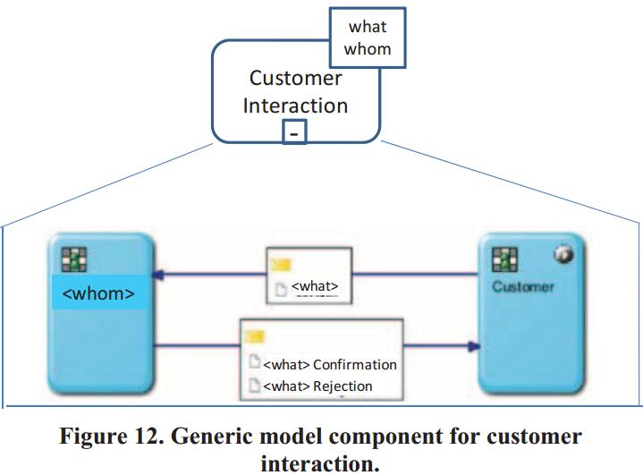
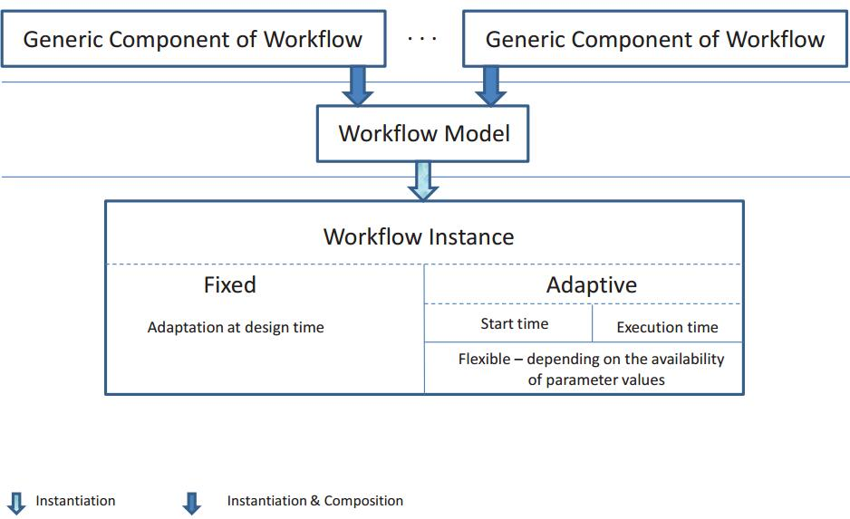

## S-BPM
1. **Albert Fleischmann, Werner Schmidt, and Christian Stary. ''Subject-oriented business process management''.  Handbook on Business Process Management 2 Springer, pp. 601-621, 2015.**  
摘要：这篇文章是对S-BPM建模方式与实现比较全面的一篇论文，适合最初了解S-BPM的人看，内容既全面又较新。S-BPM的建模主要分3三个步骤：(1)定义主题；(2)主题交互图；(3)主题行为建模。鉴于对初步了解的人来说，该文献非常重要，因此已对该文献翻译了[中文版本](resources/面向主题的业务流程管理.pdf)。

2. **Albert Fleischmann, Werner Schmidt, Christian Stary, Stefan Obermeier, and Egon Börger. Subject-oriented business process management. Springer Science & Business Media, 2012.**   
摘要：这本书对S-BPM建模、验证、优化、实现、监控、建模工具进行全面的介绍。

3. **Stephan Schiffner, Thomas Rothschädl, and Nils Meyer. "Towards a subject-oriented evolutionary business information system". Proceedings of Enterprise Distributed Object Computing Conference Workshops and Demonstrations (EDOCW), 2014 IEEE 18th International. IEEE, pp. 381-388, 2014.**  
摘要： 这篇文章对演化业务信息系统和S-BPM进行了比较，目的是提出实现基于S-BPM的演化业务信息系统的软件需求。通过比较，S-BPM基本可以满足演化信息系统的需求属性，因此认为S-BPM是一个恰当的方法来建立演化业务信息系统。文章中对的S-BPM的初步介绍非常简洁且全面，是一个值得借鉴的写法。可惜文章引用的很多关于流程变化管理方面的文献都是德文的，没法阅读。查看其引用的文献又几乎没有，无法真正了解具体的工作。

4. **Albert Fleischmann, Stephan Borgert, Matthes Elstermann, Florian Krenn, and Robert Singer. "An overview to S-BPM oriented Tool Suites". Proceedings of S-BPM ONE. pp. 30-31, 2017.**  
摘要：文章给出了目前已公布的S-BPM工具，其中介绍了7个工具，有的只适合建模，有的既可以建模也可以执行。可惜没有开源本地执行的工具，具体介绍如下表：

还好，在github上有搜索到开源的[S-BPM建模与实现工具](https://github.com/stefanstaniAIM/IPPR2016)。

5. **Peter Forbrig. "Reuse of models in S-BPM process specifications". Proceedings of the 7th International Conference on Subject-Oriented Business Process Management. ACM, pp. 6, 2015.**  
摘要：毫无疑问，领域的建模有诸多优势。现也有不同的符号的建模工具，比如：BPMN、S-BPM。尽管有很多工具支持，创建模型依然是一个挑战。从头创建模型非常耗时和易错。使用已有的模型也有一些问题。有时没有完全的执行正确，导致结果错误；也常常模型的一部分忘记改编到新的上下文。因此，重用模型已有部分的工具支持将非常有益。文章首先介绍了BPMN中如何将组件一般化，形成可以复用的组件。基本思想就是将具体业务的用参数进行泛化，使其可以描述通用的流程模型。然后，类似地将通用组件的概念引入到S-BPM中，使其模型可以重用。

同时，文章还讨论了不同的组件改编策略。

最后，给出了开发工具支持的需求分析：  
   + 支持浏览和实例化；
   + 支持静态和动态的实例；
   + 支持设计时的决策；
   + 支持模拟。  
6. **Robert Gottanka, and Nils Meyer. "ModelAsYouGo:(re-) design of S-BPM process models during execution time". Proceedings of International Conference on Subject-Oriented Business Process Management. Springer, pp. 91-105, 2012.**  
摘要：
