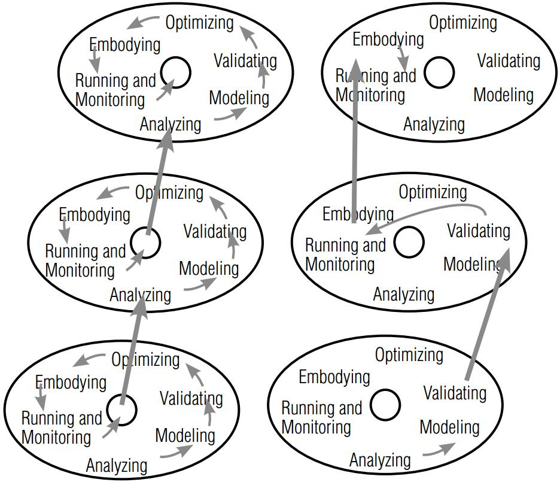

## S-BPM
1. **Albert Fleischmann, Stephan Borgert, Matthes Elstermann, Florian Krenn, and Robert Singer. "***An overview to S-BPM oriented Tool Suites***". Proceedings of S-BPM ONE. pp. 30-31, 2017.**  
摘要：文章给出了目前已公布的S-BPM工具，其中介绍了7个工具，有的只适合建模，有的既可以建模也可以执行。可惜没有开源本地执行的工具，具体介绍如下表：

还好，在github上有搜索到开源的[S-BPM建模与实现工具](https://github.com/stefanstaniAIM/IPPR2016)。

1. **Albert Fleischmann, Werner Schmidt, and Christian Stary. ''***Subject-oriented business process management***''.  Handbook on Business Process Management 2 Springer, pp. 601-621, 2015.**  
摘要：这篇文章是对S-BPM建模方式与实现比较全面的一篇论文，适合最初了解S-BPM的人看，内容既全面又较新。S-BPM的建模主要分3三个步骤：(1)定义主题；(2)主题交互图；(3)主题行为建模。鉴于对初步了解的人来说，该文献非常重要，因此已对该文献翻译了[中文版本](resources/面向主题的业务流程管理.pdf)。

5. **Peter Forbrig. "***Reuse of models in S-BPM process specifications***". Proceedings of the 7th International Conference on Subject-Oriented Business Process Management. ACM, pp. 6, 2015.**  
摘要：毫无疑问，领域的建模有诸多优势。现也有不同的符号的建模工具，比如：BPMN、S-BPM。尽管有很多工具支持，创建模型依然是一个挑战。从头创建模型非常耗时和易错。使用已有的模型也有一些问题。有时没有完全的执行正确，导致结果错误；也常常模型的一部分忘记改编到新的上下文。因此，重用模型已有部分的工具支持将非常有益。文章首先介绍了BPMN中如何将组件一般化，形成可以复用的组件。基本思想就是将具体业务的用参数进行泛化，使其可以描述通用的流程模型。然后，类似地将通用组件的概念引入到S-BPM中，使其模型可以重用，如下图所示：

同时，文章还讨论了不同的组件改编策略，如下图所示：

最后，给出了开发工具支持的需求分析：  
   + 支持浏览和实例化；
   + 支持静态和动态的实例；
   + 支持设计时的决策；
   + 支持模拟。  
1. **A Fleischmann, and W Schmidt. "***S-BPM as a new impetus in Business Process Management: A survey***". BUSINESS INFORMATICS INTERDISCIPLINARY ACADEMIC JOURNAL, Vol. 32, No. 2, pp. 7, 2015.**  
摘要：这是一篇俄文期刊的文章。简单介绍了S-BPM方法的属性，详细介绍了对BPM生命周期活动的影响。这是S-BPM提出者写的一篇综述性文章，值得初了解S-BPM的人读，有简单介绍S-BPM的由来，以及无论在工业界还是学术界引起的轩然大波，文章大张旗鼓S-BPM的优势。文章提到了两个商用的图形符号建模工具：基于Java的[Metasonic Suite](http://www.metasonic.de/)和基于.net的[InFlow](www.strict-solutions.at)。S-BPM的生命周期可以是开放性的，如下图所示：

3. **Stephan Schiffner, Thomas Rothschädl, and Nils Meyer. "***Towards a subject-oriented evolutionary business information system***". Proceedings of Enterprise Distributed Object Computing Conference Workshops and Demonstrations (EDOCW), 2014 IEEE 18th International. IEEE, pp. 381-388, 2014.**  
摘要： 这篇文章对演化业务信息系统和S-BPM进行了比较，目的是提出实现基于S-BPM的演化业务信息系统的软件需求。通过比较，S-BPM基本可以满足演化信息系统的需求属性，因此认为S-BPM是一个恰当的方法来建立演化业务信息系统。文章中对的S-BPM的初步介绍非常简洁且全面，是一个值得借鉴的写法。可惜文章引用的很多关于流程变化管理方面的文献都是德文的，没法阅读。查看其引用的文献又几乎没有，无法真正了解具体的工作。

2. **Albert Fleischmann, Werner Schmidt, Christian Stary, Stefan Obermeier, and Egon Börger. ***Subject-oriented business process management***. Springer Science & Business Media, 2012.**   
摘要：这本书对S-BPM建模、验证、优化、实现、监控、建模工具进行全面的介绍。

6. **Robert Gottanka, and Nils Meyer. "***ModelAsYouGo:(re-) design of S-BPM process models during execution time***". Proceedings of International Conference on Subject-Oriented Business Process Management. Springer, pp. 91-105, 2012.**  
摘要：文章引入了一个新方法（即，ModelAsYouGo）来建模S-BPM业务流程，使得执行者们在执行实例时可以记录他们的主题通信和内部行为。主题 的每个用户可以建模自己的内部行为，发送和接收信息。当流程涉及多个参与者时，这时协作就发生了。ModelAsYouGo使得流程执行者们可以以一种容易和社会化的方式设计可靠的模型。因此，执行者将成为业务世界的主角。可惜文章从头到尾连一个图和一个例子都没有，全是文字介绍，各种空白喊白话该方法可以干嘛干嘛，但是读之后就是不知道具体是怎么干的。文章将方法的评估的案例的系统实现作为了未来工作。不过，文章提到结构化流程的概念，值得提一下：
   + 结构化流程：是指流程模型描述从端到端严格地预定义好，不存在会偏离流程模型的实例；
   + 半结构化流程：是指生命周期没有被一个形式化模型完全定义好的业务或系统流程。通常该流程具有不完全的流程视图，流程只是以流程图，流图或抽象状态机的形式给出，其流程执行不完全被中心实体所控制。相反，使用了各种IT和人工的机制，包括email、内容管理系统、基于WEB的表单、定制应用或者这些的组合。
   + 非结构化流程：是指不可预测的流程。该流程敏感依赖于外部因素，这些因素超越了流程上下文的控制。因此，这样的流程不能根据内部状态而固化起来。

1. **Robert Singer, and Erwin Zinser. "***Business Process Management—S-BPM a New Paradigm for Competitive Advantage?***". Proceedings of International Conference on Subject-Oriented Business Process Management. Springer, pp. 48-70, 2009.**  
摘要：

 1. **Jan Vom Brocke, and Michael Rosemann. ***Business Process Management***. Springer, 2015.**  
 摘要：
 
 
